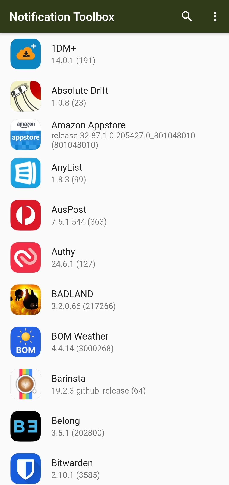
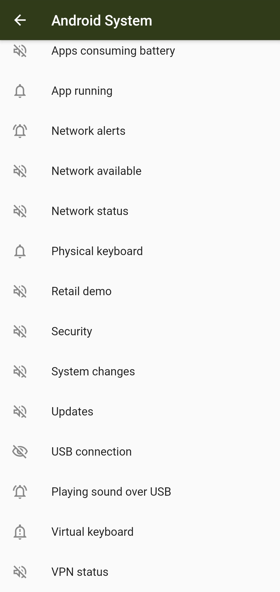
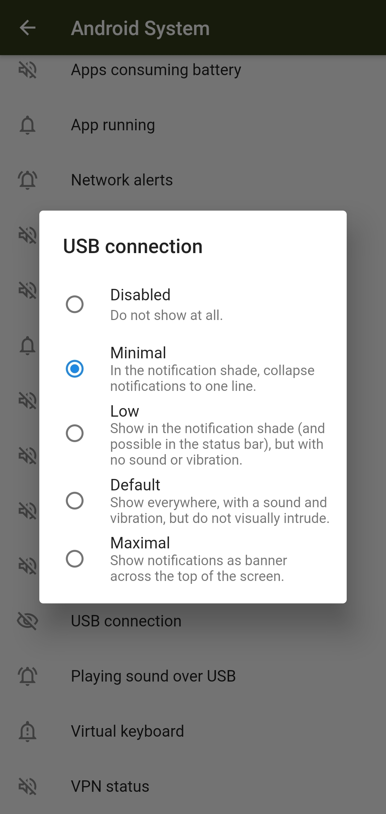

# Notification Toolbox

An Android app to manage notification settings.

## Motivation
On MIUI 12, the notification importance settings are missing.
This app brings them back.

## Requirements
### Permissions
This app requires the `STATUS_BAR_SERVICE` permission. Some versions of MIUI seem to grant this,
but AOSP does not. If your ROM does not grant the permission, consider using a tool
like [App Systemizer](https://forum.xda-developers.com/t/module-terminal-app-systemizer-v17-3-1.3585851/).

### Hidden APIs
This app makes use of hidden SDK APIs that are blocked on modern versions of Android for
apps targeting API 28 and above. Techniques to bypass this restriction are in use, but if
this effects you, build the app with a `targetSdkVersion` of `27`.

## Screenshots

## F.A.Q.

### Is this app open source?
This app is mostly open source, but the code that modifies the system notification settings
is closed source. The ability to disable notifications and boost notification intrusiveness
could be disastrous in the wrong hands.

### Why's the code so bad?
Sorry. I wrote this app in a couple of days, so the entire UI is in one file and I used Flutter
because I didn't want to spend time getting up-to-speed on the latest Android architectural practices
(last time I checked, `AsyncTask` was current...).